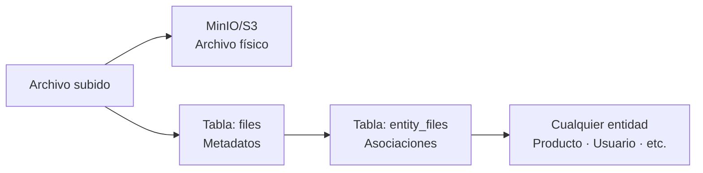
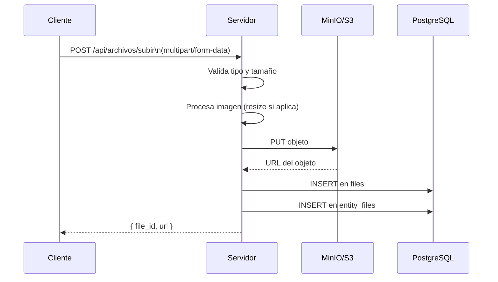

# Sistema de Archivos

Lego tiene un sistema de gestión de archivos que separa el almacenamiento físico (MinIO/S3) del registro de metadatos (PostgreSQL) y las asociaciones con entidades del sistema.

Relacionado: [[almacenamiento/minio]] · [[base-de-datos/modelos]]

---

## Tres Capas



## Tabla `files`

Guarda los metadatos de cada archivo subido:

| Campo | Tipo | Descripción |
|-------|------|-------------|
| `id` | UUID/int | ID único |
| `name` | string | Nombre original del archivo |
| `path` | string | Ruta en MinIO/S3 |
| `mime_type` | string | `image/jpeg`, `application/pdf`, etc. |
| `size` | int | Tamaño en bytes |
| `url` | string | URL pública |
| `created_at` | timestamp | Fecha de subida |

## Tabla `entity_files`

Asocia archivos con cualquier entidad del sistema sin modificar la tabla de la entidad:

| Campo | Tipo | Descripción |
|-------|------|-------------|
| `id` | int | PK |
| `file_id` | FK | Referencia a `files` |
| `entity_type` | string | Nombre de la entidad (`producto`, `usuario`) |
| `entity_id` | int | ID del registro |
| `label` | string | Etiqueta del archivo (`foto_perfil`, `documento_contrato`) |
| `is_primary` | bool | Si es el archivo principal de la entidad |

## Modelo EntityFile

```php
// Un producto puede tener múltiples archivos
$producto->files()->where('label', 'imagen_principal')->first();

// Asociar un archivo a un producto
EntityFile::create([
    'file_id'     => $file->id,
    'entity_type' => 'producto',
    'entity_id'   => $producto->id,
    'label'       => 'galeria',
    'is_primary'  => false,
]);
```

## Intervención de Imagen

Para redimensionar y manipular imágenes antes de subirlas, Lego usa `intervention/image`:

```php
use Intervention\Image\ImageManager;

$manager = new ImageManager(['driver' => 'gd']);
$image   = $manager->make($archivoSubido);
$image->resize(800, 600, function($constraint) {
    $constraint->aspectRatio();
});
$image->save($rutaTemporal);
```

## Flujo de Subida



## Visión

> El sistema de archivos tendrá un gestor visual integrado en el panel: un explorador de archivos estilo Google Drive donde se pueden ver, organizar y vincular archivos a entidades sin escribir código. Las entidades declararán sus zonas de archivos mediante atributos, y el gestor las mostrará automáticamente.
