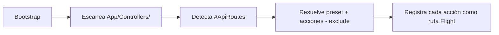

# Controladores

Los controladores contienen la lógica de negocio de las rutas de API. En Lego se registran automáticamente mediante el atributo `#[ApiRoutes]`.

Relacionado: [[api/atributos]] · [[api/crud-automatico]] · [[base-de-datos/modelos]]

Código: `Core/Routing/ApiControllerRouter.php` · `App/Controllers/`

---

## Estructura de un Controlador

```php
namespace App\Controllers\Productos\Controllers;

use Core\Attributes\ApiRoutes;
use Core\Controllers\CoreController;

#[ApiRoutes('/productos', preset: 'crud')]
class ProductosController extends CoreController
{
    public function list(): void
    {
        $productos = Producto::paginate(20);
        $this->json($productos);
    }

    public function get(string $id): void
    {
        $producto = Producto::findOrFail($id);
        $this->json($producto);
    }

    public function create(): void
    {
        $data = $this->body();
        $producto = Producto::create($data);
        $this->json($producto, 201);
    }

    public function update(string $id): void
    {
        $data = $this->body();
        $producto = Producto::findOrFail($id)->update($data);
        $this->json(['updated' => true]);
    }

    public function delete(string $id): void
    {
        Producto::findOrFail($id)->delete();
        $this->json(['deleted' => true]);
    }
}
```

## Métodos Heredados de CoreController

| Método | Descripción |
|--------|-------------|
| `$this->json($data, $status)` | Responde con JSON |
| `$this->body(): array` | Lee el cuerpo de la request como array |
| `$this->query(string $key): mixed` | Lee un parámetro de query string |
| `$this->param(string $key): mixed` | Lee un parámetro de ruta |
| `$this->validate(array $rules): array` | Valida datos con reglas Laravel |

## Auto-Descubrimiento

`ApiControllerRouter` escanea `App/Controllers/` recursivamente. Cualquier clase con `#[ApiRoutes]` se registra automáticamente al arrancar la aplicación.



## Namespaces

Los controladores siguen la convención de namespaces:

```
App/Controllers/
└── Productos/
    └── Controllers/
        └── ProductosController.php
        // namespace App\Controllers\Productos\Controllers;
```

## Controladores de Default (CRUD/GET)

Cuando se usa `#[ApiCrudResource]` o `#[ApiGetResource]` sin especificar `controllerClass`, el framework usa los controladores por defecto:

- `Core/Controllers/DefaultCrudController.php` — para `ApiCrudResource`
- `Core/Controllers/AbstractGetController.php` — para `ApiGetResource`

Estos manejan paginación, filtrado, búsqueda y ordenamiento de forma genérica.

## Validación

```php
public function create(): void
{
    $data = $this->validate([
        'nombre'    => 'required|max:100',
        'precio'    => 'required|numeric|min:0',
        'categoria' => 'required|in:tech,ropa,hogar',
    ]);

    $producto = Producto::create($data);
    $this->json($producto, 201);
}
```

Si la validación falla, el framework retorna automáticamente `422 Unprocessable Entity` con los errores.

## Visión

> Los controladores tendrán soporte para policies: `$this->authorize('create', Producto::class)` verificará automáticamente si el usuario autenticado tiene permiso para esa acción. Sin código adicional en cada método — el framework intercepta y responde `403` si el permiso no existe.
