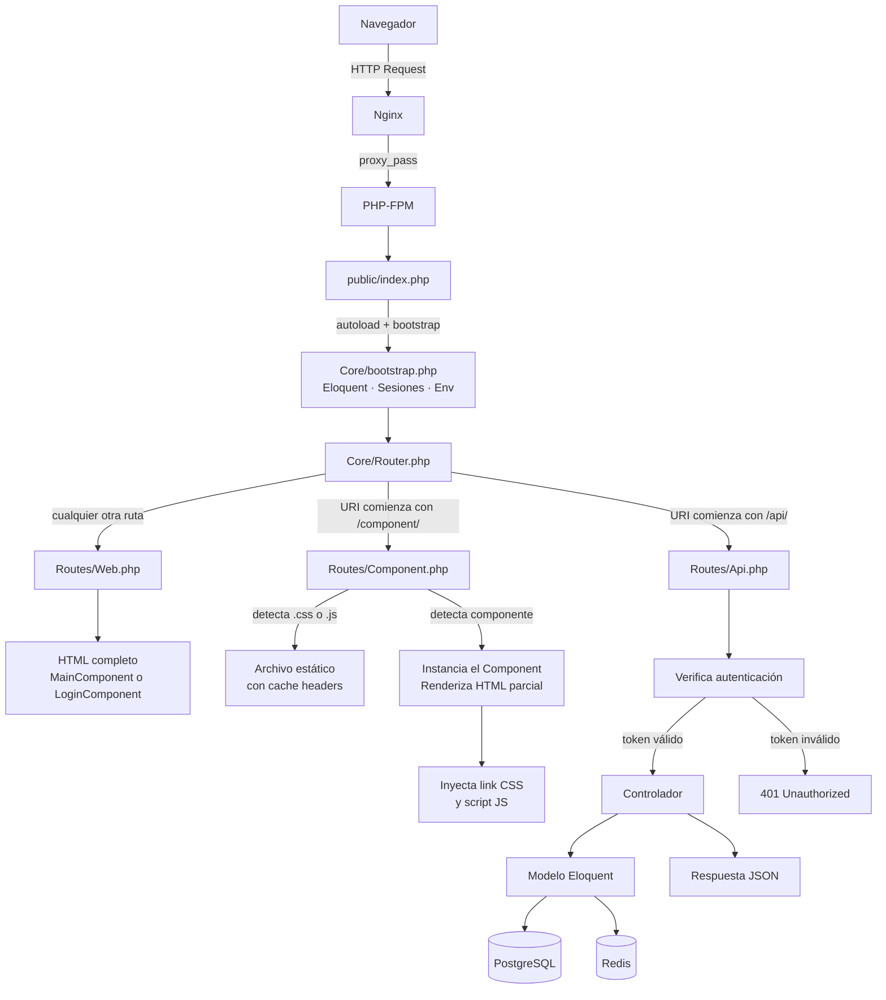
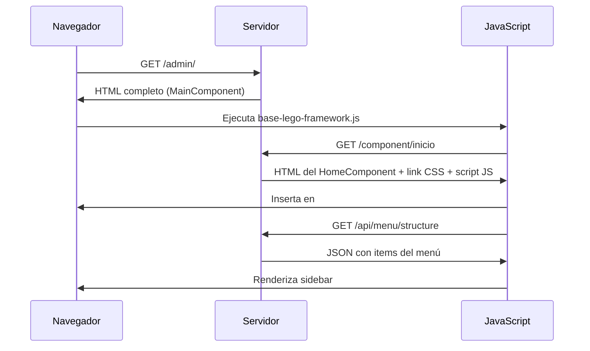

# Flujo de una Request

Qué sucede exactamente desde que el navegador hace una petición HTTP hasta que el usuario ve una respuesta.

Relacionado: [[arquitectura/vision-general]] · [[routing/tres-capas]] · [[componentes/core-component]]

---

## Mapa Completo



## Tres Tipos de Request

### 1. Request Web — Entrada al SPA

```
GET /admin/
  → Routes/Web.php
  → new MainComponent()
  → HTML completo (DOCTYPE, HEAD, BODY)
  → Incluye sidebar, scripts globales, contenedor vacío
```

El usuario solo hace esta request una vez. Todo lo demás son requests de componente o API.

### 2. Request de Componente — Navegación SPA

```
GET /component/usuarios
  → Routes/Component.php
  → Detecta componente con #[ApiComponent('/usuarios')]
  → new UsersComponent()
  → HTML parcial (sin DOCTYPE ni HEAD)
  → JavaScript lo inserta en el contenedor del SPA
```

Los assets (CSS, JS) se inyectan automáticamente como `<link>` y `<script>`.

### 3. Request de API — Datos

```
GET /api/users-config?page=1&sort=name
  → Routes/Api.php
  → Verifica JWT
  → AbstractGetController::list()
  → User::query()->paginate()
  → JSON { data: [...], meta: {...} }
```

## Bootstrap: Lo que sucede antes del Router

`Core/bootstrap.php` ejecuta esto en orden:

1. Carga variables de entorno (`.env`)
2. Conecta Eloquent a PostgreSQL
3. Inicia sesión PHP
4. Registra componentes dinámicos
5. Configura paginación de Illuminate

## Carga de una Página Nueva (primera vez)



## Visión

> En el futuro, el flujo incluirá pre-carga inteligente: cuando el usuario hace hover sobre un item del menú, el componente ya se descarga en segundo plano. La percepción de velocidad mejora sin cambiar la arquitectura de "servidor como fuente de verdad".
