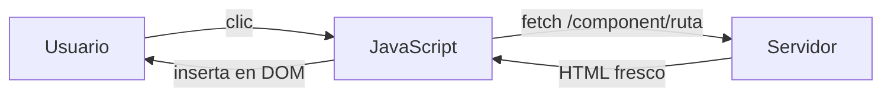
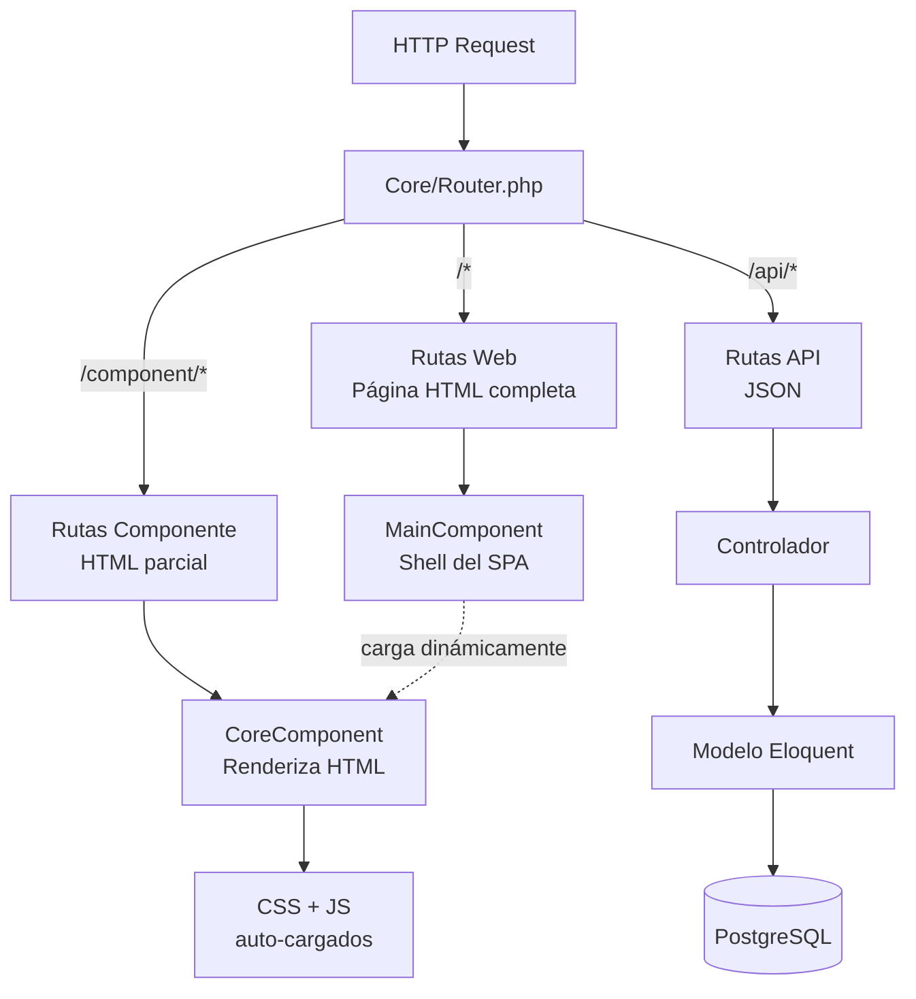

# Visión General de Lego

Lego es un **framework PHP de componentes** para construir aplicaciones web de administración. Inspirado en Flutter y Angular, pero implementado en PHP puro con JavaScript vanilla: sin bundler, sin framework JS, sin estado en el cliente.

Relacionado: [[arquitectura/flujo-request]] · [[arquitectura/capas]] · [[componentes/core-component]]

---

## Filosofía Central

**El servidor es la fuente de verdad.**

Cada vez que el usuario interactúa, el componente se recarga desde el servidor. No hay estado que sincronizar entre cliente y servidor, no hay inconsistencias, no hay conflictos.

## Principios

| Principio | Significado |
|-----------|------------|
| **Todo es un componente** | Pantalla, botón, tabla, formulario — todos extienden `CoreComponent` |
| **Sin estado frontend** | El servidor genera HTML completo en cada carga |
| **Configuración mínima** | Atributos PHP declaran rutas, APIs y comportamientos |
| **Composable** | Los componentes se contienen unos a otros mediante composición |
| **Auto-descubrimiento** | El framework detecta componentes y controladores automáticamente |

## Cómo Encajan las Piezas

## Stack Tecnológico

**Backend**
- PHP 8.3
- [Flight](https://flightphp.com/) — router HTTP ligero
- Illuminate Eloquent — ORM
- Firebase JWT — autenticación

**Base de Datos**
- PostgreSQL 17 — principal
- Redis — caché y sesiones
- MongoDB — datos no relacionales (opcional)

**Almacenamiento**
- MinIO — compatible con S3

**Frontend**
- Vanilla JavaScript (sin framework)
- CSS Variables para temas
- Ion Icons

**Testing**
- Pest — tests unitarios y de arquitectura

**Infraestructura**
- Docker Compose + Nginx

## Visión

> Lego como el framework de referencia para paneles de administración PHP. Un solo desarrollador construye una aplicación completa y mantenible. La curva de aprendizaje es baja porque los componentes son PHP puro, los endpoints se generan solos, y el sistema de menú y ventanas es declarativo.
>
> A futuro: generador de código desde la CLI, marketplace de componentes reutilizables, y soporte multi-tenant nativo.
