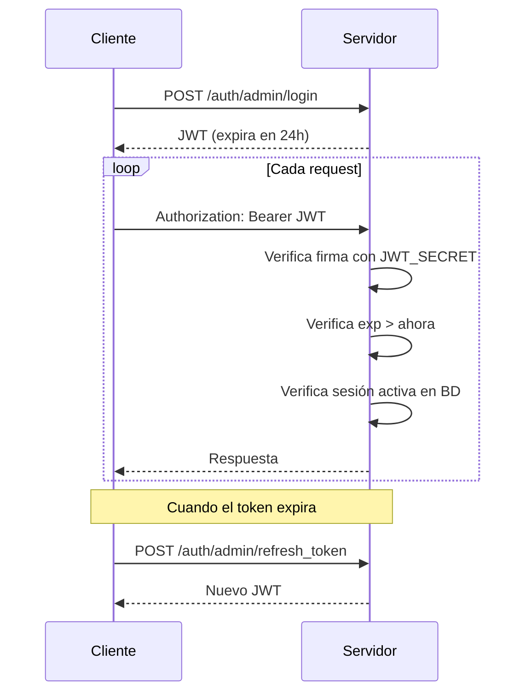

# JWT

Lego usa JSON Web Tokens (JWT) para autenticar todas las requests de API. La librería es `firebase/php-jwt`.

Relacionado: [[autenticacion/sistema-auth]] · [[autenticacion/grupos-auth]]

---

## Estructura del Token

Un JWT tiene tres partes separadas por `.`:

```
eyJhbGciOiJIUzI1NiJ9        ← Header (algoritmo)
.eyJ1c2VyX2lkIjoxfQ         ← Payload (datos)
.SflKxwRJSMeKKF2QT4fwpM     ← Firma (verificación)
```

## Payload del Token en Lego

```json
{
    "user_id": 1,
    "group": "admin",
    "role_id": 2,
    "exp": 1735689600,
    "iat": 1735603200
}
```

| Campo | Descripción |
|-------|-------------|
| `user_id` | ID del usuario autenticado |
| `group` | Grupo de autenticación |
| `role_id` | Rol del usuario |
| `exp` | Timestamp de expiración |
| `iat` | Timestamp de emisión |

## Ciclo de Vida



## Configuración

El secret se define en `.env`:

```
JWT_SECRET=una_clave_segura_de_al_menos_32_chars
```

> [!warning] Seguridad
> El `JWT_SECRET` debe ser una cadena aleatoria larga. Si se compromete, todos los tokens existentes deben invalidarse cambiando el secret.

## Invalidación Manual

A diferencia de los JWT puros (stateless), Lego valida también contra la tabla `auth_user_sessions`. Esto permite:

- Logout real (invalida el token aunque no haya expirado)
- Sesiones múltiples simultáneas por usuario
- Revocar acceso de forma inmediata

## Refresh Token

Cuando el access token expira, el cliente llama a `/auth/{grupo}/refresh_token` con el token expirado. Si la sesión sigue activa en BD, se emite un nuevo token.

## Visión

> En el futuro se añadirá soporte para tokens de larga duración (API keys) que no expiran y están diseñados para integraciones máquina-a-máquina. Serán un tipo de token diferente al JWT de sesión de usuario.
