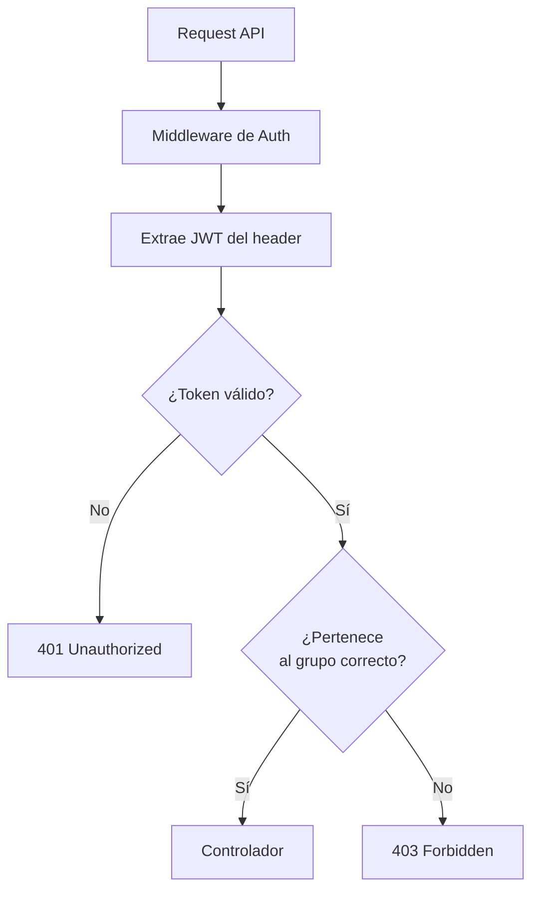
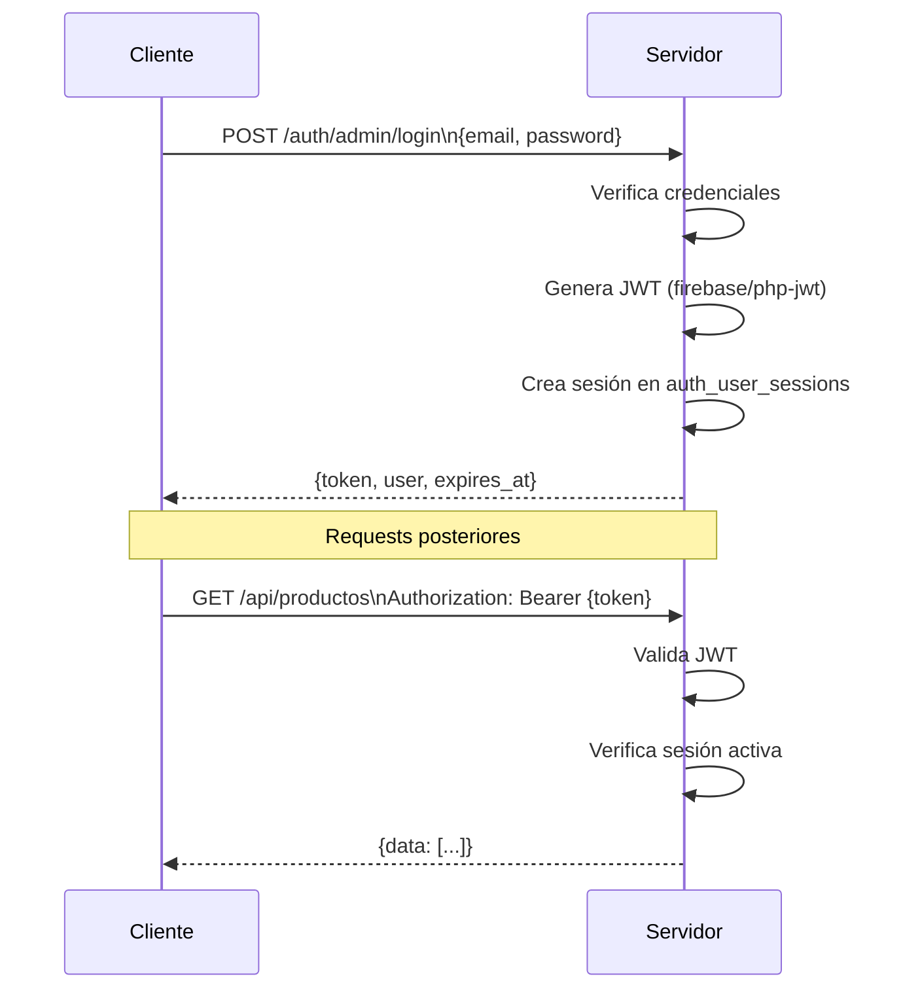

# Sistema de Autenticación

Lego tiene un sistema de autenticación modular. Pueden coexistir múltiples grupos de autenticación completamente aislados entre sí.

Relacionado: [[autenticacion/grupos-auth]] · [[autenticacion/jwt]] · [[routing/rutas-api]]

---

## Arquitectura



## Flujo de Login



## Rutas de Auth por Grupo

```
POST /auth/{grupo}/login          ← Login, retorna JWT
POST /auth/{grupo}/logout         ← Invalida el token
POST /auth/{grupo}/refresh_token  ← Renueva el JWT
GET  /auth/{grupo}/me             ← Datos del usuario actual
```

Grupos existentes: `admin`, `api`. Ver [[autenticacion/grupos-auth]].

## Sesiones

Cada login crea un registro en `auth_user_sessions` con:
- Token JWT (hasheado)
- Timestamp de última actividad
- IP del cliente
- User agent

Al hacer requests, el middleware actualiza `last_activity`. Si el token expira o la sesión se invalida, la siguiente request retorna `401`.

## Niveles de Protección

| Ruta | Protección |
|------|-----------|
| `/*` (web) | Sesión PHP — redirige a `/login` |
| `/component/*` | JWT — retorna 401 si inválido |
| `/api/*` | JWT — retorna 401 si inválido |
| `/login`, `/auth/*` | Pública — sin autenticación |

## Modelos Involucrados

- `User` (`auth_users`) — usuarios del sistema
- `Role` (`auth_roles`) — roles con permisos
- `AuthGroup` (`auth_groups`) — grupos de autenticación
- `UserSession` (`auth_user_sessions`) — sesiones activas

## Visión

> La autenticación evolucionará hacia un sistema de permisos granular: cada ruta, componente y acción declarará los permisos requeridos mediante atributos. El framework evaluará los permisos del usuario en tiempo de request, sin código de verificación en cada controlador. También se añadirá soporte para OAuth2 como método de autenticación alternativo.
