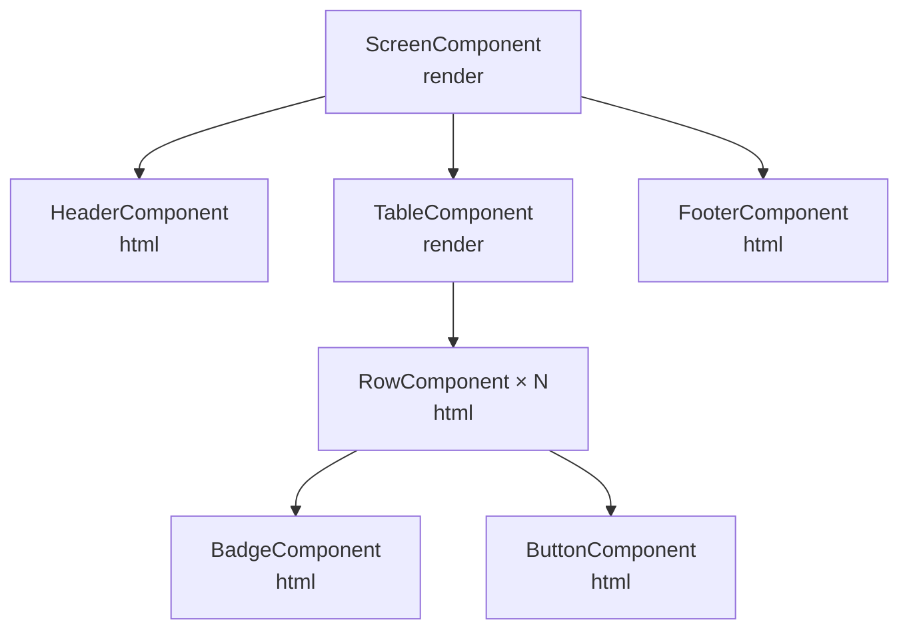

# Composición de Componentes

Los componentes se componen entre sí. Un componente puede contener otros componentes, formando un árbol.

Relacionado: [[componentes/core-component]] · [[componentes/slots]]

---

## Composición Directa

La forma más simple: instanciar un componente dentro del `component()` de otro.

```php
protected function component(): string
{
    $titulo = new TitleComponent(text: "Lista de Productos");
    $tabla  = new TableComponent(model: "products");
    $btn    = new ButtonComponent(label: "Agregar", icon: "add-outline");

    return <<<HTML
    <div class="productos-screen">
        {$titulo->render()}
        {$btn->render()}
        {$tabla->render()}
    </div>
    HTML;
}
```

## Children Array

Para cuando el contenedor no sabe de antemano qué componentes va a recibir:

```php
class ContainerComponent extends CoreComponent
{
    public function __construct(
        public array $children = []
    ) {}

    protected function component(): string
    {
        return <<<HTML
        <div class="container">
            {$this->renderChildren()}
        </div>
        HTML;
    }
}
```

Uso:

```php
new ContainerComponent(children: [
    new ButtonComponent(label: "Guardar"),
    new ButtonComponent(label: "Cancelar", variant: "secondary"),
]);
```

## Diferencia: render() vs html()

| Método | Assets CSS/JS | Cuándo usar |
|--------|--------------|-------------|
| `render()` | ✅ Incluye | Componente raíz de una sección |
| `html()` | ❌ Solo HTML | Componente embebido dentro de otro |

> [!warning] Evitar doble carga de assets
> Si un componente hijo se usa muchas veces en la misma pantalla, usar `html()` para las instancias adicionales. Los assets solo necesitan cargarse una vez.

## Árbol de Composición Típico



## Componentes Compartidos

Los componentes en `components/shared/` están diseñados para ser reutilizados por cualquier componente de la aplicación:

- `components/shared/Buttons/` — botones con variantes
- `components/shared/Forms/` — inputs, selects, textareas
- `components/shared/Essentials/` — Grid, Row, Column
- `components/shared/Navigation/` — tabs, breadcrumbs
- `components/shared/FragmentComponent/` — wrapper genérico

## Visión

> La composición es el mecanismo principal de reutilización en Lego. A futuro se formalizará un catálogo visual de componentes compartidos (similar a Storybook pero nativo PHP), donde cada componente documenta sus variantes y props directamente desde el código.
