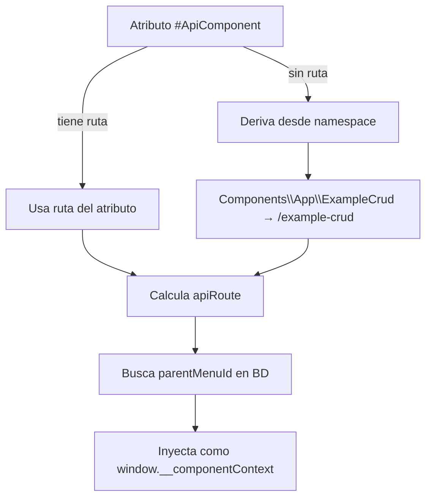

# Contexto de Componente

El `ComponentContextTrait` expone datos PHP al JavaScript del componente de forma automática, sin strings mágicos ni configuración manual.

Relacionado: [[componentes/core-component]] · [[componentes/pantallas]] · [[frontend/window-manager]]

Código: `Core/Traits/ComponentContextTrait.php`

---

## El Problema que Resuelve

Sin contexto, el JavaScript de un componente necesita saber su propia ruta de API de forma hardcodeada:

```javascript
// ❌ Sin contexto — string mágico, frágil
fetch('/api/example-crud/list')
```

Con contexto, las rutas se derivan automáticamente desde el atributo PHP del componente:

```javascript
// ✅ Con contexto — derivado del servidor
const ctx = ComponentContext.current();
fetch(ctx.api('list'));
```

## Cómo Usarlo

```php
use Core\Traits\ComponentContextTrait;
use Core\Attributes\ApiComponent;

#[ApiComponent('/example-crud')]
class ExampleCrudComponent extends CoreComponent
{
    use ComponentContextTrait;

    protected function component(): string
    {
        $context = $this->renderContext(); // Inyecta <script> con el contexto

        return <<<HTML
        <div class="lego-screen">
            {$context}
            <!-- contenido -->
        </div>
        HTML;
    }
}
```

## Qué Contiene el Contexto

El objeto inyectado en `window.__componentContext`:

| Campo | Ejemplo | Origen |
|-------|---------|--------|
| `id` | `'example-crud'` | Derivado del namespace |
| `route` | `'/component/example-crud'` | Del atributo `#[ApiComponent]` |
| `apiRoute` | `'/api/example-crud'` | Derivado del `route` |
| `parentMenuId` | `'example-crud'` | Desde la BD proceduralmente |
| `className` | `'ExampleCrudComponent'` | Nombre de la clase |
| `namespace` | `'Components\\App\\ExampleCrud'` | Namespace completo |

## API JavaScript

```javascript
const ctx = ComponentContext.current();

ctx.id                    // 'example-crud'
ctx.route                 // '/component/example-crud'
ctx.apiRoute              // '/api/example-crud'
ctx.api('list')           // '/api/example-crud/list'
ctx.api('delete')         // '/api/example-crud/delete'
ctx.child('edit')         // '/component/example-crud/edit'
ctx.child('create')       // '/component/example-crud/create'
ctx.parentMenuId          // 'example-crud'
```

## Derivación Automática

El contexto se construye en este orden de prioridad:



## Métodos PHP

| Método | Retorna |
|--------|---------|
| `getComponentContext(): array` | Array completo del contexto |
| `renderContext(): string` | `<script>` con el contexto inyectado |
| `getContextId(): string` | Solo el ID del componente |
| `getContextApiRoute(): string` | Solo la ruta de API |
| `getContextParentMenuId(): ?string` | Solo el parentMenuId |

## Visión

> El contexto eliminará por completo la necesidad de hardcodear rutas en el JavaScript. A futuro incluirá también permisos del usuario actual (qué acciones puede ejecutar sobre este componente), evitando consultas adicionales al API solo para saber si un botón debe mostrarse o no.
