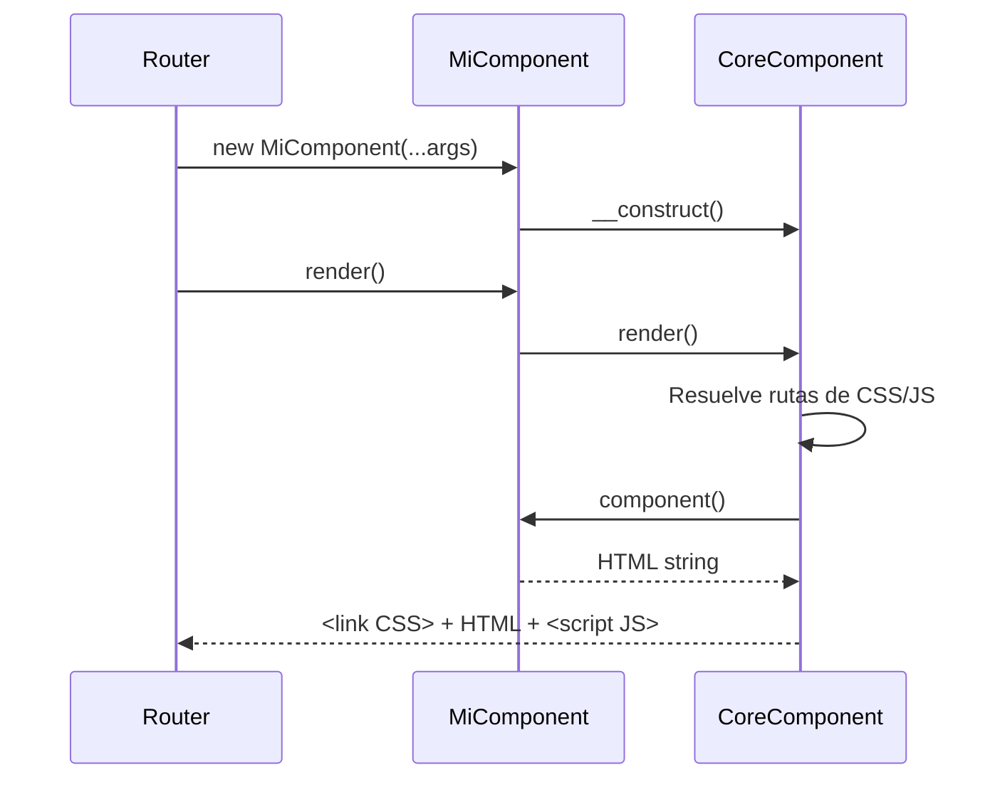

# CoreComponent

La clase base de todo el sistema de componentes. Todo componente en Lego extiende `CoreComponent`.

Relacionado: [[componentes/composicion]] · [[componentes/slots]] · [[componentes/assets]] · [[componentes/pantallas]] · [[componentes/contexto-componente]]

Código: `Core/Components/CoreComponent/CoreComponent.php`

---

## Qué es un Componente

Un componente es una unidad de UI auto-contenida con tres partes:

```
components/App/MiFeature/
├── MiFeatureComponent.php   ← lógica + HTML (PHP)
├── mi-feature.css           ← estilos
└── mi-feature.js            ← interactividad
```

Los tres archivos viven juntos. Los assets se cargan automáticamente.

## Estructura Mínima

```php
namespace Components\App\MiFeature;

use Core\Components\CoreComponent\CoreComponent;

class MiFeatureComponent extends CoreComponent
{
    protected $CSS_PATHS = ["./mi-feature.css"];
    protected $JS_PATHS  = ["./mi-feature.js"];

    public function __construct(
        public string $titulo,
        public bool $activo = true
    ) {}

    protected function component(): string
    {
        return <<<HTML
        <div class="mi-feature">
            <h1>{$this->titulo}</h1>
        </div>
        HTML;
    }
}
```

## Ciclo de Vida



## Propiedades

| Propiedad | Tipo | Descripción |
|-----------|------|-------------|
| `$CSS_PATHS` | `array` | Rutas de CSS a inyectar como `<link>` |
| `$JS_PATHS` | `array` | Rutas de JS a cargar como módulos |
| `$JS_PATHS_WITH_ARG` | `array` | JS con argumentos PHP pasados al script |
| `$children` | `array` | Componentes hijos para composición |

## Métodos

| Método | Descripción |
|--------|-------------|
| `component(): string` | **Abstracto.** Retorna el HTML del componente |
| `render(): string` | HTML completo con CSS + HTML + JS |
| `html(): string` | Solo HTML, sin assets (para composición interna) |
| `renderChildren(): string` | Renderiza todos los `$children` |
| `renderSlot(array $slot): string` | Renderiza un slot nombrado |

## Rutas de Assets

```php
protected $CSS_PATHS = ["./styles.css"];     // relativa al componente
protected $CSS_PATHS = ["../shared/utils.css"]; // relativa al padre
protected $CSS_PATHS = ["assets/css/global.css"]; // absoluta desde root
```

Ver [[componentes/assets]] para el sistema completo de carga.

## Composición

Los componentes se llaman unos a otros usando `->render()` o `->html()`:

```php
protected function component(): string
{
    $boton  = new ButtonComponent(label: "Guardar");
    $input  = new InputTextComponent(id: "nombre");

    return <<<HTML
    <div>
        {$input->render()}
        {$boton->render()}
    </div>
    HTML;
}
```

Ver [[componentes/composicion]] y [[componentes/slots]] para patrones avanzados.

## Exposición a JavaScript

El trait `ComponentContextTrait` expone datos PHP al JavaScript del componente de forma segura, sin strings mágicos. Ver [[componentes/contexto-componente]].

## Visión

> El objetivo es que `CoreComponent` sea la única clase que un desarrollador necesite conocer para construir cualquier parte de la UI. En el futuro, el componente tendrá soporte nativo para hidratación parcial: solo re-renderizar las partes que cambiaron, sin recargar el componente completo.
