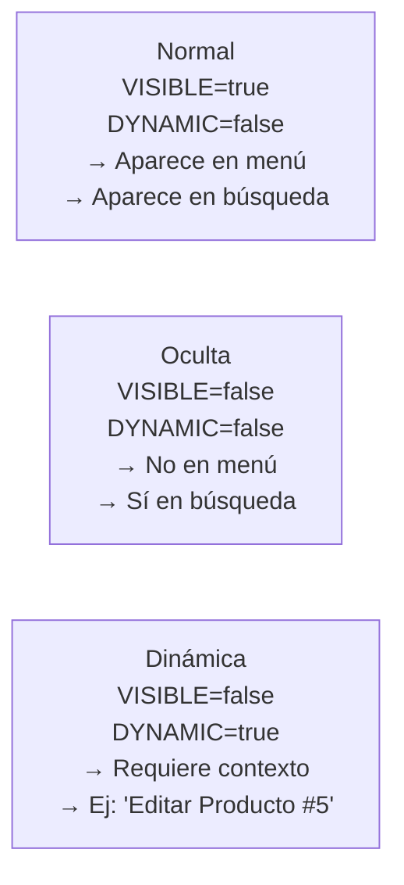

# Pantallas (Screens)

Una pantalla es un componente que representa una ventana o sección del sistema. Implementa `ScreenInterface` para que el framework pueda registrarla en el menú y en el sistema de navegación.

Relacionado: [[componentes/core-component]] · [[menu/estructura-menu]] · [[menu/screens-registry]] · [[frontend/window-manager]]

Código: `Core/Contracts/ScreenInterface.php` · `Core/Traits/ScreenTrait.php`

---

## Estructura

```php
use Core\Contracts\ScreenInterface;
use Core\Traits\ScreenTrait;
use Core\Attributes\ApiComponent;

#[ApiComponent('/productos', methods: ['GET'])]
class ProductosListComponent extends CoreComponent implements ScreenInterface
{
    use ScreenTrait;

    public const SCREEN_ID     = 'productos-list';
    public const SCREEN_LABEL  = 'Ver Productos';
    public const SCREEN_ICON   = 'cube-outline';
    public const SCREEN_ROUTE  = '/component/productos';
    public const SCREEN_ORDER  = 10;
    public const SCREEN_VISIBLE = true;
    public const SCREEN_DYNAMIC = false;

    protected function component(): string
    {
        $screenId = self::SCREEN_ID;
        return <<<HTML
        <div class="lego-screen lego-screen--padded" data-screen-id="{$screenId}">
            <div class="lego-screen__content">
                <!-- contenido -->
            </div>
        </div>
        HTML;
    }
}
```

## Constantes

| Constante | Requerida | Defecto | Descripción |
|-----------|-----------|---------|-------------|
| `SCREEN_ID` | ✅ | — | ID único en todo el sistema |
| `SCREEN_ROUTE` | ✅ | — | Ruta del componente |
| `SCREEN_LABEL` | ❌ | `SCREEN_ID` | Texto en el menú |
| `SCREEN_ICON` | ❌ | `document-outline` | Nombre de icono Ionicon |
| `SCREEN_ORDER` | ❌ | `100` | Orden de aparición en menú |
| `SCREEN_VISIBLE` | ❌ | `true` | Si aparece en el sidebar |
| `SCREEN_DYNAMIC` | ❌ | `false` | Si se activa por contexto |

> [!warning] Obsoletos — No usar
> `SCREEN_PARENT` y `MENU_GROUP_ID` están obsoletos. El `parent_id` se obtiene proceduralmente desde la base de datos usando `SCREEN_ID`. La BD es la fuente de verdad.

## Tres Tipos de Pantalla



**Normal** — pantallas principales del módulo (lista, dashboard)
**Oculta** — pantallas de configuración accesibles por búsqueda
**Dinámica** — pantallas que dependen de un registro específico (editar, ver detalle)

## Jerarquía en el Menú

La estructura padre-hijo se define en [[menu/estructura-menu|MenuStructure.php]] mediante `children`. El `parent_id` se deduce automáticamente de esa jerarquía — nunca se define como constante.

```
📁 productos              ← grupo del menú (MenuStructure.php)
├── 📄 productos-list     ← SCREEN_ID del componente principal
├── 📄 productos-create   ← SCREEN_VISIBLE = true
└── 📄 productos-edit     ← SCREEN_DYNAMIC = true
```

## Wrapper HTML Obligatorio

Toda pantalla usa el wrapper estándar para que el sistema de módulos funcione correctamente:

```php
<div class="lego-screen lego-screen--padded" data-screen-id="productos-list">
    <div class="lego-screen__content">
        <!-- contenido aquí -->
    </div>
</div>
```

El atributo `data-screen-id` es lo que usa el [[frontend/window-manager|Window Manager]] para identificar y controlar la pantalla.

## Registrar en el Sistema

1. Añadir la pantalla a [[menu/screens-registry|ScreenRegistry]] en `Core/Registry/Screens.php`
2. Añadir un item en [[menu/estructura-menu|MenuStructure]] si debe aparecer en el menú
3. Ejecutar `php lego config:reset` para sincronizar con la BD

## Visión

> A futuro, `ScreenInterface` incluirá un método `getPermissions()` que declare qué roles pueden ver esta pantalla. El framework ocultará automáticamente los items del menú y bloqueará el acceso a componentes según el rol del usuario autenticado, sin código adicional en cada pantalla.
