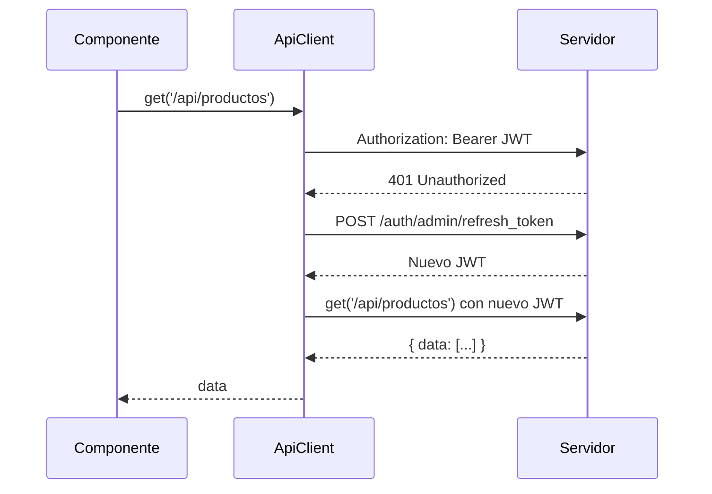

# API Client

El `ApiClient` es el cliente HTTP que usan los componentes JavaScript para hablar con el backend. Encapsula la autenticación JWT, manejo de errores y serialización JSON.

Relacionado: [[autenticacion/jwt]] · [[routing/rutas-api]] · [[componentes/contexto-componente]]

Código: `assets/js/core/api/ApiClient.js`

---

## Por Qué Existe

Sin un cliente centralizado, cada componente tendría que:
- Añadir el header `Authorization: Bearer ...`
- Serializar el body
- Parsear la respuesta JSON
- Manejar errores 401, 422, 500
- Renovar el token cuando expira

El `ApiClient` resuelve todo esto en un solo lugar.

## Uso Básico

```javascript
import { ApiClient } from '/assets/js/core/api/ApiClient.js';

// GET
const productos = await ApiClient.get('/api/productos?page=1');

// POST
const nuevo = await ApiClient.post('/api/productos', {
    nombre: 'Laptop Pro',
    precio: 1500.00,
});

// PUT
await ApiClient.put('/api/productos/5', { precio: 1400.00 });

// DELETE
await ApiClient.delete('/api/productos/5');
```

## Combinado con ComponentContext

```javascript
const ctx = ComponentContext.current();

// En vez de hardcodear la ruta
const productos = await ApiClient.get(ctx.api('list'));
const nuevo     = await ApiClient.post(ctx.api('create'), data);
```

Ver [[componentes/contexto-componente]].

## Manejo de Errores

```javascript
try {
    const data = await ApiClient.post('/api/productos', payload);
} catch (error) {
    if (error.status === 422) {
        // Errores de validación
        console.log(error.errors); // { campo: ['mensaje'] }
    } else if (error.status === 401) {
        // Token inválido — el cliente intenta refresh automáticamente
    } else {
        // Error genérico
        console.error(error.message);
    }
}
```

## Renovación Automática de Token



El cliente intenta una renovación automática antes de fallar. Si la renovación también falla, redirige a `/login`.

## Cabeceras Estándar

| Cabecera | Valor |
|----------|-------|
| `Authorization` | `Bearer {jwt}` (automático) |
| `Content-Type` | `application/json` |
| `Accept` | `application/json` |
| `X-Requested-With` | `XMLHttpRequest` |

## Visión

> El `ApiClient` añadirá soporte para reintentos automáticos con backoff exponencial en errores 5xx, cancelación de requests obsoletas (cuando una nueva request del mismo tipo llega antes de que termine la anterior), y un modo offline que encola las mutaciones para reenviarlas cuando vuelva la conectividad.
