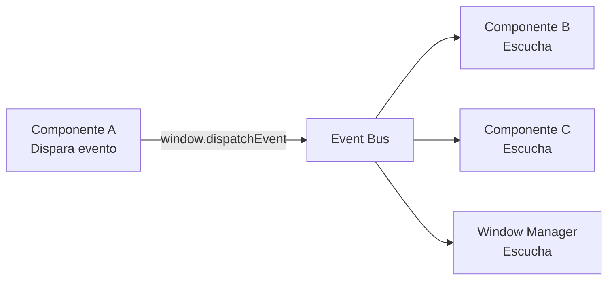

# Sistema de Eventos

Lego usa un bus de eventos basado en `CustomEvent` nativo del navegador. Permite que módulos se comuniquen sin acoplarse directamente.

Relacionado: [[frontend/window-manager]] · [[componentes/contexto-componente]]

Código: `assets/js/core/modules/events/lego-events.js`

---

## Patrón Pub/Sub



## Escuchar Eventos

```javascript
window.addEventListener('lego:module:activated', (e) => {
    console.log('Módulo activo:', e.detail.moduleId);
});

window.addEventListener('lego:data:updated', (e) => {
    if (e.detail.entity === 'producto') {
        // Refrescar tabla de productos
    }
});
```

## Disparar Eventos

```javascript
window.dispatchEvent(new CustomEvent('lego:data:updated', {
    detail: {
        entity: 'producto',
        action: 'created',
        id:     123,
    }
}));
```

## Eventos del Framework

| Evento | Dispara | Detail |
|--------|---------|--------|
| `lego:module:activated` | WindowManager | `{ moduleId }` |
| `lego:module:closed` | WindowManager | `{ moduleId }` |
| `lego:module:reloaded` | WindowManager | `{ moduleId }` |
| `lego:auth:logout` | Después de logout | `{}` |
| `lego:theme:changed` | Cambio de tema | `{ theme }` |
| `lego:menu:updated` | Refresh del menú | `{}` |

## Convención de Nombres

```
lego:{categoria}:{accion}
```

| Parte | Ejemplos |
|-------|---------|
| Categoría | `module`, `auth`, `data`, `theme`, `menu` |
| Acción | `activated`, `closed`, `updated`, `created`, `deleted` |

## Ejemplo: Refresh Cruzado entre Módulos

```javascript
// Módulo "productos-create" guarda un producto
await ApiClient.post(ctx.api('create'), data);

// Notifica al sistema
window.dispatchEvent(new CustomEvent('lego:data:updated', {
    detail: { entity: 'producto', action: 'created' }
}));

// Cierra la ventana
wm.closeCurrentWindow();
```

```javascript
// Módulo "productos-list" escucha y se refresca
window.addEventListener('lego:data:updated', (e) => {
    if (e.detail.entity === 'producto') {
        tableManager.reload();
    }
});
```

## Visión

> El sistema de eventos tendrá una alternativa basada en canales tipados con TypeScript, donde cada evento declara su shape y los listeners se autocompletan en el editor. También se añadirá un panel de debugging que muestra todos los eventos disparados en tiempo real, similar a Redux DevTools.
