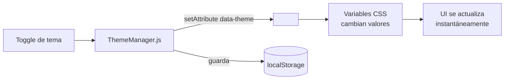

# Gestión de Temas

Lego soporta modo claro y oscuro mediante variables CSS. El cambio es instantáneo, sin recargar la página.

Relacionado: [[frontend/eventos]] · [[componentes/assets]]

Código: `assets/css/core/theme-variables.css` · `assets/js/core/modules/theme/theme-manager.js`

---

## Cómo Funciona



## Variables CSS

```css
/* assets/css/core/theme-variables.css */

:root[data-theme="light"] {
    --color-bg:        #ffffff;
    --color-text:      #1a1a1a;
    --color-primary:   #007bff;
    --color-border:    #e0e0e0;
    --color-card:      #f8f9fa;
}

:root[data-theme="dark"] {
    --color-bg:        #1a1a1a;
    --color-text:      #f0f0f0;
    --color-primary:   #4dabf7;
    --color-border:    #404040;
    --color-card:      #2a2a2a;
}
```

## Usar Variables en Componentes

```css
.mi-componente {
    background: var(--color-bg);
    color:      var(--color-text);
    border:     1px solid var(--color-border);
}

.mi-componente__card {
    background: var(--color-card);
}
```

> [!tip]
> Nunca hardcodear colores en CSS de componentes. Siempre usar variables del tema. Esto garantiza que los componentes se vean correctos en cualquier modo.

## API JavaScript

```javascript
import { ThemeManager } from '/assets/js/core/modules/theme/theme-manager.js';

// Obtener tema actual
const current = ThemeManager.get(); // 'light' o 'dark'

// Cambiar tema
ThemeManager.set('dark');
ThemeManager.set('light');

// Toggle
ThemeManager.toggle();

// Suscribirse a cambios
window.addEventListener('lego:theme:changed', (e) => {
    console.log('Nuevo tema:', e.detail.theme);
});
```

## Persistencia

El tema seleccionado se guarda en `localStorage` con la clave `lego.theme`. En la siguiente carga, el `ThemeManager` lo restaura antes de renderizar.

## Detección de Preferencia del Sistema

```javascript
// El framework detecta la preferencia del SO si no hay nada guardado
window.matchMedia('(prefers-color-scheme: dark)').matches
```

## Visión

> El sistema de temas evolucionará para soportar temas personalizados por usuario o por workspace. Un panel de configuración permitirá ajustar colores específicos (primario, fondo, acentos) y exportarlos como temas reutilizables. Los componentes seguirán usando las mismas variables — solo cambian los valores de raíz.
