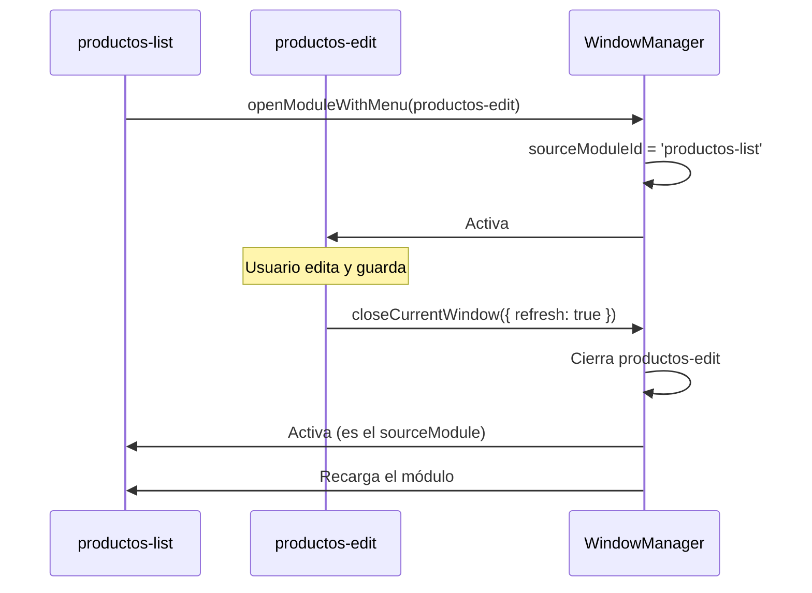

# Window Manager

El `WindowManager` es el corazón de la navegación SPA en Lego. Gestiona qué módulos están abiertos, cuál está activo, y orquesta la apertura, cierre y recarga de pantallas.

Relacionado: [[componentes/pantallas]] · [[menu/items-dinamicos]] · [[frontend/eventos]]

Código: `assets/js/core/modules/windows-manager/windows-manager.js`

---

## Conceptos

| Concepto | Definición |
|----------|-----------|
| **Módulo** | Instancia de una pantalla cargada en memoria |
| **ModuleStore** | Estado interno: qué módulos hay abiertos |
| **WindowManager** | API pública para manipular módulos |
| **sourceModuleId** | El módulo padre desde donde se abrió otro |

## Estado Interno

```javascript
{
    modules: {
        'productos-list': {
            component:       'ProductosListComponent',
            isActive:        true,
            params:          { columnFilters: { ... } },
            sourceModuleId:  null
        },
        'productos-edit': {
            component:       'ProductosEditComponent',
            isActive:        false,
            params:          {},
            sourceModuleId:  'productos-list'
        }
    },
    activeModule: 'productos-list'
}
```

## API Principal

```javascript
const wm = window.legoWindowManager;

// Abrir un módulo simple
wm.openModule('productos-list', '/component/productos');

// Abrir un módulo dinámico con item de menú
wm.openModuleWithMenu({
    moduleId: 'productos-edit',
    label:    'Editar Producto',
    url:      '/component/productos/edit?id=5',
    icon:     'create-outline',
});

// Cerrar un módulo específico
wm.closeModule('productos-edit');

// Cerrar el módulo activo
wm.closeCurrentWindow();
wm.closeCurrentWindow({ refresh: true }); // Refresca el padre

// Recargar el módulo activo
wm.reloadActive();
```

## Parámetros Persistentes

Datos que sobreviven recargas pero se limpian al cerrar el módulo. Útil para filtros de tabla, búsqueda activa, etc.

```javascript
// Guardar
wm.setParam('columnFilters', { name: 'test' });

// Leer
const filters = wm.getParam('columnFilters');

// Todos
const params = wm.getParams();

// Eliminar uno
wm.removeParam('columnFilters');

// Limpiar todos
wm.clearParams();
```

## Navegación Padre-Hijo



## Eventos

```javascript
window.addEventListener('lego:module:activated', (e) => {
    console.log('Módulo activo:', e.detail.moduleId);
});

window.addEventListener('lego:module:closed', (e) => {
    console.log('Módulo cerrado:', e.detail.moduleId);
});

window.addEventListener('lego:module:reloaded', (e) => {
    console.log('Módulo recargado:', e.detail.moduleId);
});
```

Ver [[frontend/eventos]] para el sistema completo.

## Contenedores DOM

Cada módulo tiene su propio contenedor `<div>`:

```html
<div id="module-productos-list" class="module-container active">
    <!-- Contenido del componente -->
</div>
<div id="module-productos-edit" class="module-container">
    <!-- Componente cargado pero oculto -->
</div>
```

Solo el módulo activo es visible. Los demás están en el DOM pero ocultos.

## Buenas Prácticas

> [!warning] Funciones globales únicas por módulo
> Si dos módulos definen `window.openEditModule`, el último cargado sobrescribe al anterior. Solución: usar nombres únicos como `window.openEditRoleModule`, `window.openEditUserModule`. Ver [[componentes/contexto-componente]] para evitarlo con el sistema de contexto.

## Visión

> El `WindowManager` evolucionará para soportar múltiples ventanas visibles simultáneamente (split view), drag-and-drop entre ventanas, y sesión persistente: al refrescar la página, los módulos abiertos se restauran tal cual estaban.
