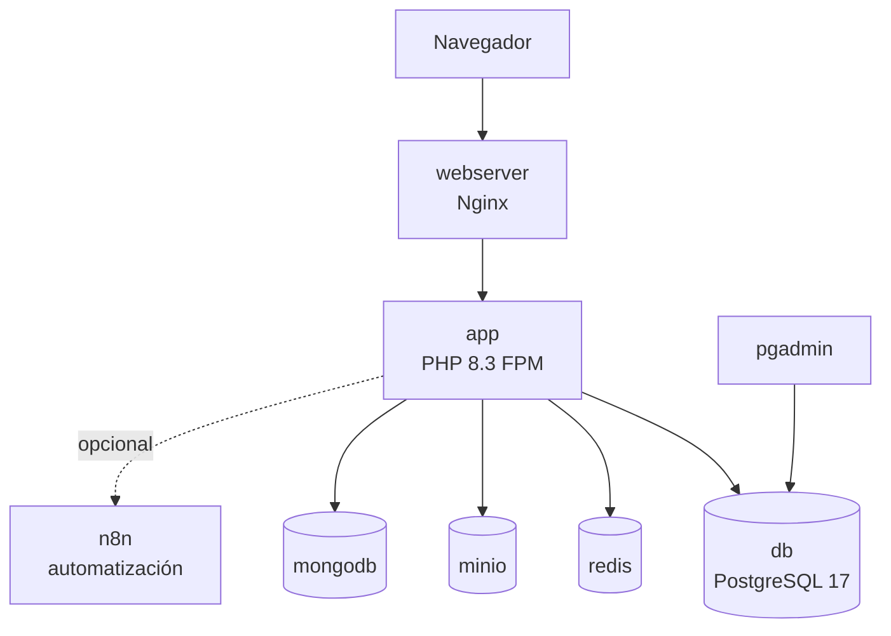

# Docker

Lego se desarrolla y despliega usando Docker Compose. Cada servicio corre en su propio contenedor, aislado pero conectado por una red Docker compartida.

Relacionado: [[infraestructura/redis]] · [[base-de-datos/postgresql]] · [[almacenamiento/minio]]

Código: `docker-compose.yml` · `Dockerfile`

---

## Servicios



## Servicios en docker-compose.yml

| Servicio | Imagen | Puerto | Propósito |
|----------|--------|--------|-----------|
| `app` | Custom (Dockerfile) | — | PHP 8.3 FPM con extensiones |
| `webserver` | `nginx:alpine` | 80 | Reverse proxy + archivos estáticos |
| `db` | `postgres:17` | 5432 | Base de datos principal |
| `pgadmin` | `dpage/pgadmin4` | 8081 | UI para PostgreSQL |
| `redis` | `redis:alpine` | 6379 | Caché y sesiones |
| `mongodb` | `mongo:latest` | 27017 | NoSQL opcional |
| `minio` | `minio/minio` | 9000, 9001 | Almacenamiento S3 |
| `n8n` | `n8nio/n8n` | 5678 | Automatización (opcional) |
| `init-permissions` | — | — | Inicializa permisos al arrancar |

## Comandos Útiles

```bash
# Levantar todo el stack
docker compose up -d

# Ver logs en tiempo real
docker compose logs -f app

# Reconstruir el contenedor de la app (después de cambiar Dockerfile)
docker compose build app

# Detener todo
docker compose down

# Detener y eliminar volúmenes (¡borra datos!)
docker compose down -v

# Ejecutar comando dentro del contenedor de la app
docker compose exec app php lego migrate

# Ver estado de los servicios
docker compose ps
```

## Dockerfile (servicio app)

```
FROM php:8.3-fpm

# Extensiones: pdo_pgsql, redis, mongodb, gd, zip, intl
RUN docker-php-ext-install ...

# Composer
COPY --from=composer /usr/bin/composer /usr/bin/composer

# Código de la app
COPY . /var/www/html
WORKDIR /var/www/html

RUN composer install --no-dev --optimize-autoloader
```

## Red

Todos los servicios comparten la red `lego-network`. Esto permite que se referencien por nombre de servicio:

```
DB_HOST=db          # ← nombre del servicio, no localhost
REDIS_HOST=redis
AWS_ENDPOINT=http://minio:9000
```

## Volúmenes Persistentes

| Volumen | Servicio | Propósito |
|---------|----------|-----------|
| `lego-db-data` | db | Datos de PostgreSQL |
| `lego-mongo-data` | mongodb | Datos de MongoDB |
| `lego-minio-data` | minio | Archivos subidos |
| `lego-redis-data` | redis | Persistencia de Redis |

Si haces `docker compose down -v`, todos los datos se borran. Para preservarlos: `docker compose down` (sin `-v`).

## Variables de Entorno

El archivo `.env` en la raíz del proyecto se lee automáticamente por Docker Compose (variables `DB_*`, `REDIS_*`, `MINIO_*`, etc.) y por la aplicación PHP (vía `phpdotenv`).

## Visión

> El stack incluirá un servicio dedicado de workers para procesamiento en background (colas de jobs), un servicio de búsqueda full-text (MeiliSearch o ElasticSearch), y un servicio de monitoreo de logs (Loki + Grafana). Todo seguirá la filosofía: un servicio = un contenedor, conectados por la red de Docker.
