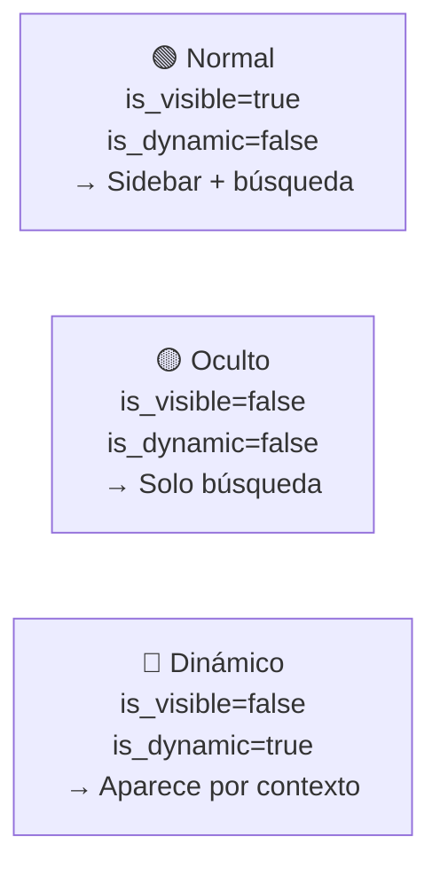

# Estructura del Menú

El menú lateral del SPA se define de forma centralizada en `MenuStructure.php` y se sincroniza con la base de datos. La BD es la fuente de verdad en runtime.

Relacionado: [[menu/screens-registry]] · [[menu/items-dinamicos]] · [[componentes/pantallas]]

Código: `Core/Config/MenuStructure.php`

---

## Filosofía

La jerarquía del menú se define en `MenuStructure.php` usando las constantes de los `ScreenComponent`. Esto mantiene la sincronía entre el código y el menú — si renombras una pantalla, el menú se actualiza al hacer `config:reset`.

```php
// Core/Config/MenuStructure.php
class MenuStructure
{
    public static function get(): array
    {
        return [
            [
                'id'            => self::getGroupIdFromRoute(ProductosListComponent::SCREEN_ROUTE),
                'label'         => 'Productos',
                'icon'          => 'cube-outline',
                'display_order' => 1,
                'is_visible'    => true,
                'is_dynamic'    => false,
                'children'      => [
                    [
                        'id'    => ProductosListComponent::SCREEN_ID,
                        'label' => ProductosListComponent::SCREEN_LABEL,
                        'icon'  => ProductosListComponent::SCREEN_ICON,
                        'route' => ProductosListComponent::SCREEN_ROUTE,
                    ],
                    [
                        'id'    => ProductosCreateComponent::SCREEN_ID,
                        // ...
                    ],
                ]
            ]
        ];
    }
}
```

## Propiedades de un Item

| Propiedad | Tipo | Descripción |
|-----------|------|-------------|
| `id` | `string` | ID único del item |
| `label` | `string` | Texto visible en el menú |
| `route` | `string` | Ruta al hacer clic |
| `icon` | `string` | Nombre de icono Ionicon |
| `display_order` | `int` | Orden de aparición |
| `is_visible` | `bool` | Si aparece en el sidebar |
| `is_dynamic` | `bool` | Si requiere contexto para activarse |
| `children` | `array` | Items hijos (define la jerarquía) |

> [!warning] Auto-deducidos — No definir
> `parent_id` y `level` se deducen automáticamente de la jerarquía `children`. Nunca definirlos manualmente.

## Tipos de Item



## Jerarquía

```
📁 productos (grupo, nivel 0)
├── 📄 productos-list  (nivel 1, is_visible=true)
├── 📄 productos-create (nivel 1, is_visible=true)
└── 📄 productos-edit  (nivel 1, is_visible=false, is_dynamic=true)
```

Los grupos de nivel 0 no son pantallas — son agrupadores visuales en el sidebar.

## Sincronizar con la BD

```bash
php lego config:reset
```

Este comando ejecuta el seed `seed_menu_items.php` que:
1. Lee `MenuStructure::get()`
2. Deduce `parent_id` y `level` desde la jerarquía
3. Hace upsert en la tabla `menu_items`

**Ejecutar siempre que se agregue, elimine o renombre una pantalla.**

## Búsqueda del Menú

```
GET /api/menu/search?q=productos
```

Busca en:
- Items con `is_visible = true`
- Items con `is_visible = false` y `is_dynamic = false`

Excluye items dinámicos (requieren contexto para tener sentido).

## Visión

> `MenuStructure.php` desaparecerá. El menú se construirá completamente desde el `ScreenRegistry`: cada pantalla declara su posición, y el framework deduce el árbol automáticamente. Sin archivo de configuración separado — las constantes de la pantalla son la única fuente de verdad.
