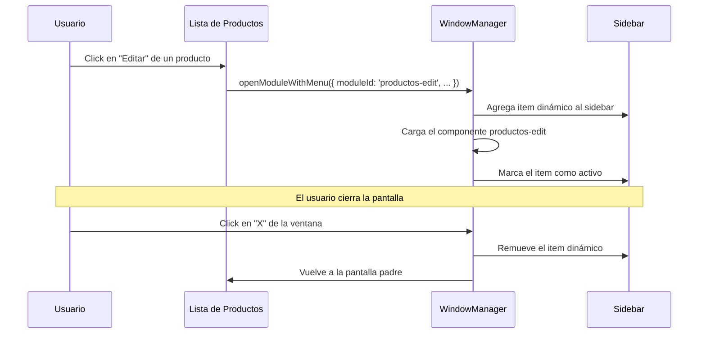

# Items Dinámicos

Los items dinámicos son entradas del menú que se agregan en runtime cuando el contexto lo requiere. Son típicos de pantallas de edición o detalle, donde el item depende de un registro específico.

Relacionado: [[menu/estructura-menu]] · [[componentes/pantallas]] · [[frontend/window-manager]]

---

## Cuándo se Usan

Cuando una pantalla depende de un dato específico para tener sentido:

- "Editar Producto #5"
- "Ver Detalle del Pedido #1234"
- "Configurar Usuario: Carlos Pérez"

Estos items no pueden estar siempre en el menú — se generan cuando el usuario activa la acción.

## Cómo Funcionan



## API JavaScript

```javascript
// Abrir un módulo dinámico con item de menú asociado
window.legoWindowManager.openModuleWithMenu({
    moduleId: 'productos-edit',
    label:    'Editar Producto #5',
    url:      '/component/productos/edit?id=5',
    icon:     'create-outline',
});

// El item dinámico se elimina automáticamente al cerrar el módulo
window.legoWindowManager.closeModule('productos-edit');
```

> [!info] parentMenuId automático
> Antes había que pasar `parentMenuId` manualmente. Ahora se obtiene automáticamente desde la BD usando el `SCREEN_ID` del módulo. Nunca hardcodearlo.

## Definir una Pantalla como Dinámica

```php
class ProductosEditComponent extends CoreComponent implements ScreenInterface
{
    use ScreenTrait;

    public const SCREEN_ID      = 'productos-edit';
    public const SCREEN_VISIBLE = false;
    public const SCREEN_DYNAMIC = true;
    public const SCREEN_LABEL   = 'Editar Producto';
    public const SCREEN_ICON    = 'create-outline';
    public const SCREEN_ROUTE   = '/component/productos/edit';
}
```

## Búsqueda

Los items dinámicos **NO** aparecen en `/api/menu/search`. Esto es intencional: buscar "Editar Producto" no tiene sentido sin un producto específico.

## Visión

> Los items dinámicos podrán declarar sus parámetros requeridos directamente en la pantalla: `public const SCREEN_PARAMS = ['id'];`. El framework validará que esos parámetros estén presentes al abrir el módulo, y los expondrá al JavaScript via [[componentes/contexto-componente|ComponentContext]] sin parsear la URL manualmente.
