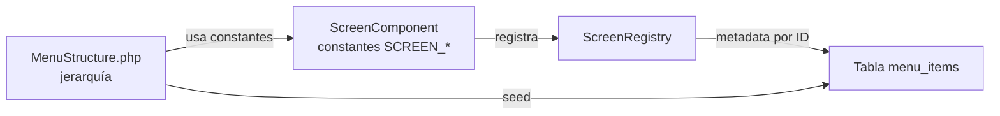

# Screen Registry

El `ScreenRegistry` es el registro central de todas las pantallas del sistema. Permite consultar metadata, generar el árbol del menú y construir la navegación de forma centralizada.

Relacionado: [[componentes/pantallas]] · [[menu/estructura-menu]] · [[menu/items-dinamicos]]

Código: `Core/Registry/ScreenRegistry.php` · `Core/Registry/Screens.php`

---

## Para Qué Sirve

Sin un registro central, cada parte del sistema (menú, búsqueda, navegación) tendría que escanear todas las pantallas por su cuenta. El `ScreenRegistry` centraliza esta información en un solo lugar, accesible mediante una API uniforme.

## Registrar Pantallas

```php
// Core/Registry/Screens.php
ScreenRegistry::registerMany([
    HomeComponent::class,
    ProductosListComponent::class,
    ProductosCreateComponent::class,
    ProductosEditComponent::class,
    UsersConfigComponent::class,
    // ...
]);
```

## API del Registry

| Método | Descripción |
|--------|-------------|
| `register(string $screenClass)` | Registra una pantalla |
| `registerMany(array $classes)` | Registra varias pantallas |
| `get(string $id): ?array` | Obtiene metadata por ID |
| `has(string $id): bool` | Verifica si una pantalla existe |
| `all(): array` | Todas las pantallas registradas |
| `getVisible(): array` | Solo las visibles en menú |
| `getByParent(?string $parentId): array` | Filtra por padre |
| `getMenuStructure(): array` | Genera el árbol del menú |

## Uso Típico

```php
// Obtener metadata de una pantalla
$meta = ScreenRegistry::get('productos-list');
// → ['id' => 'productos-list', 'label' => 'Ver Productos', 'route' => ..., ...]

// Verificar si existe
if (ScreenRegistry::has('productos-edit')) {
    // ...
}

// Generar menú dinámicamente
$menu = ScreenRegistry::getMenuStructure();
```

## Relación con MenuStructure



Por ahora coexisten:
- `ScreenRegistry` provee metadata individual de pantallas
- `MenuStructure` provee la jerarquía manual del menú

La visión es unificar ambos en el futuro (ver más abajo).

## Visión

> El `ScreenRegistry` se construirá automáticamente: el framework escaneará `components/` al arrancar y registrará toda clase que implemente `ScreenInterface`. Eliminará por completo la necesidad de mantener un archivo `Screens.php` con los registros manuales. La jerarquía del menú también se deducirá de un nuevo atributo `#[Screen(parent: 'productos')]` directamente en cada pantalla.
