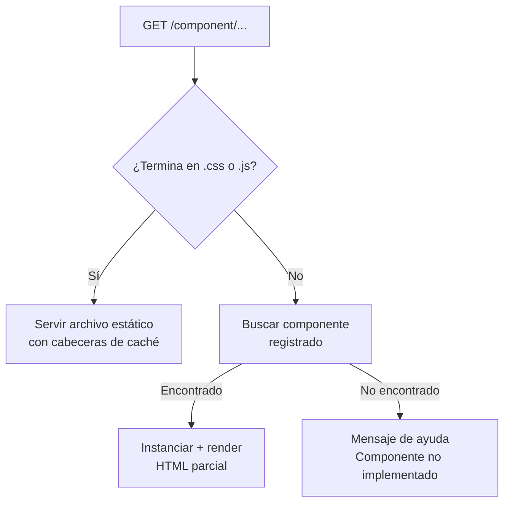

# Rutas de Componentes

Las rutas de componentes sirven HTML parcial para la navegación SPA, y también sirven los archivos estáticos (CSS, JS) de cada componente.

Relacionado: [[routing/tres-capas]] · [[componentes/core-component]] · [[componentes/assets]]

Código: `Routes/Component.php` · `Core/Services/ApiRouteDiscovery.php`

---

## Dos Funciones en Una Capa



## Auto-Descubrimiento

Los componentes se registran automáticamente usando el atributo `#[ApiComponent]`:

```php
#[ApiComponent('/productos', methods: ['GET'])]
class ProductosListComponent extends CoreComponent { ... }
```

El servicio `ApiRouteDiscovery` escanea recursivamente `components/` en busca de archivos `*Component.php`, detecta el atributo, y registra la ruta. No hay que tocar ningún archivo de rutas.

**Orden de registro:** rutas más largas primero. Así `/productos/editar` se registra antes que `/productos`, evitando capturas incorrectas.

## Servicio de Assets

Cuando la URL es `/component/productos/styles.css`:

1. Se resuelve la ruta real del archivo en el filesystem
2. Se envía con `Content-Type: text/css`
3. Cache `max-age=31536000, immutable`
4. ETag basado en el contenido del archivo
5. Si el cliente tiene el archivo en caché, responde `304 Not Modified`

## Placeholder

Si se accede a `/component/una-ruta-sin-implementar`, en vez de un error 404 el framework muestra un mensaje útil:

```
Componente '/una-ruta-sin-implementar' no encontrado.
Para implementarlo, crea:
  components/App/UnaRutaSinImplementar/UnaRutaSinImplementarComponent.php
  con el atributo #[ApiComponent('/una-ruta-sin-implementar')]
```

Esto es útil cuando se agrega un item al menú antes de implementar la pantalla.

## Cómo el SPA Carga Componentes

```javascript
// El window manager hace esto internamente
const response = await fetch('/component/productos');
const html = await response.text();
document.getElementById('home-page').innerHTML = html;

// Los <link> y <script> del HTML parcial
// se ejecutan automáticamente al insertarse
```

## Autenticación

Las rutas de componentes verifican JWT por defecto (`requiresAuth: true` en `#[ApiComponent]`). Para componentes públicos:

```php
#[ApiComponent('/publico', methods: ['GET'], requiresAuth: false)]
```

## Visión

> El auto-descubrimiento evolucionará para soportar lazy loading real: los componentes no se registran al inicio, sino que se descubren en la primera request. Esto reducirá el tiempo de arranque en proyectos con cientos de componentes.
