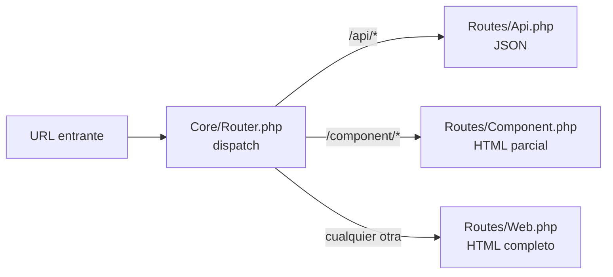

# Sistema de Routing

Lego tiene tres capas de routing perfectamente separadas. Cada capa responde a un prefijo de URL diferente y retorna un tipo de contenido distinto.

Relacionado: [[routing/rutas-web]] · [[routing/rutas-componentes]] · [[routing/rutas-api]] · [[arquitectura/flujo-request]]

Código: `Core/Router.php`

---

## Las Tres Capas



| Capa | Prefijo | Retorna | Autenticación |
|------|---------|---------|--------------|
| [[routing/rutas-web\|Web]] | `/*` | HTML completo (DOCTYPE + HEAD + BODY) | Sesión PHP |
| [[routing/rutas-componentes\|Componente]] | `/component/*` | HTML parcial o archivo estático | JWT o sesión |
| [[routing/rutas-api\|API]] | `/api/*` | JSON | JWT |

## Orden de Evaluación

El router evalúa `/api/*` primero, luego `/component/*`, y finalmente cualquier otra ruta. Esto evita que rutas web capturen accidentalmente requests de API.

```php
// Core/Router.php — dispatch()
if (str_starts_with($uri, '/api/')) {
    require Routes/Api.php;
} elseif (str_starts_with($uri, '/component/')) {
    require Routes/Component.php;
} else {
    require Routes/Web.php;
}
```

## Servicio de Archivos Estáticos

El router maneja directamente los archivos estáticos (imágenes, fuentes, assets no pertenecientes a componentes) con:
- Detección de tipo MIME
- Cache `max-age=31536000, immutable` (1 año)
- Validación ETag
- Respuesta `304 Not Modified`

Los assets de componentes (`.css`, `.js`) son servidos por [[routing/rutas-componentes]].

## Auto-Descubrimiento de Rutas

Las rutas no se registran todas manualmente. El framework usa atributos PHP para descubrirlas:

- `#[ApiComponent('/ruta')]` → auto-registra en `/component/ruta`
- `#[ApiRoutes('/endpoint')]` → auto-registra en `/api/endpoint`
- `#[ApiCrudResource]` → auto-registra 5 endpoints CRUD
- `#[ApiGetResource]` → auto-registra 2 endpoints GET

Ver [[api/atributos]] para el sistema completo.

## Visión

> El router evolucionará para soportar grupos de rutas con middleware compartido, versionado de API (`/api/v2/`), y rate limiting por grupo de autenticación. La estructura de tres capas se mantiene — solo se añaden capacidades dentro de cada capa.
